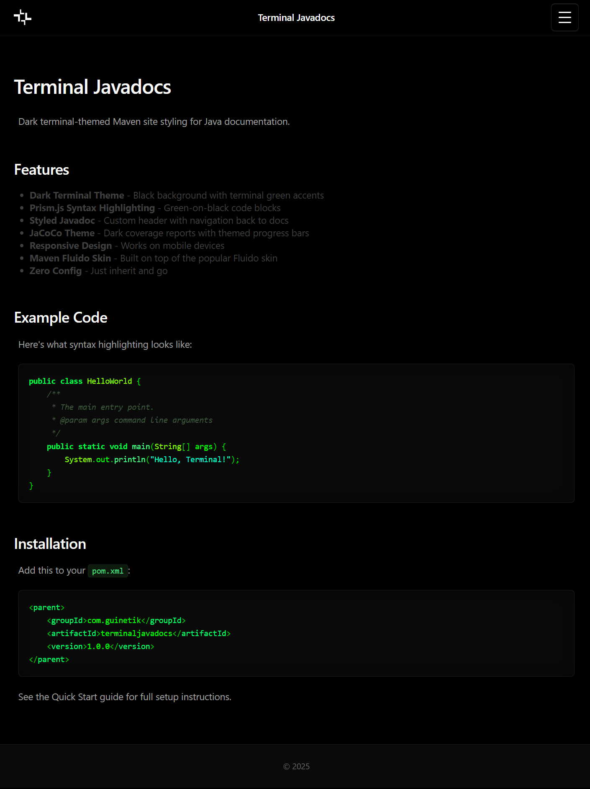
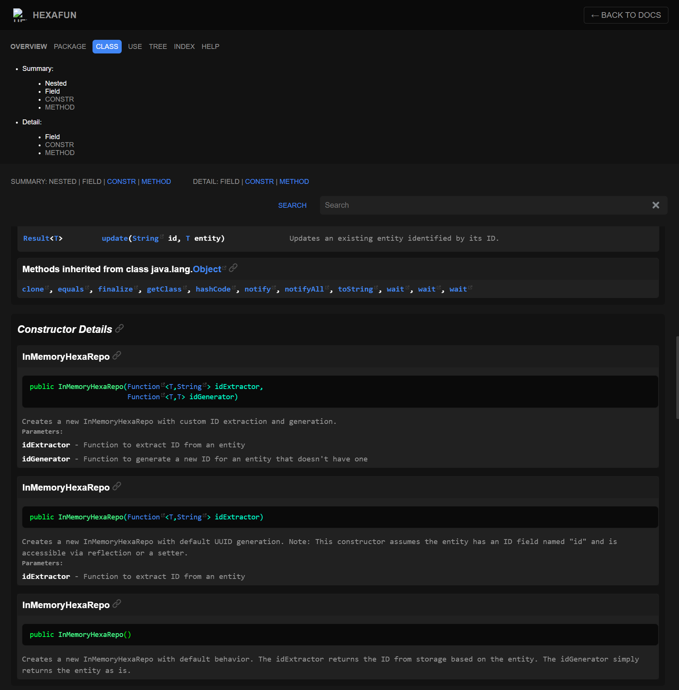
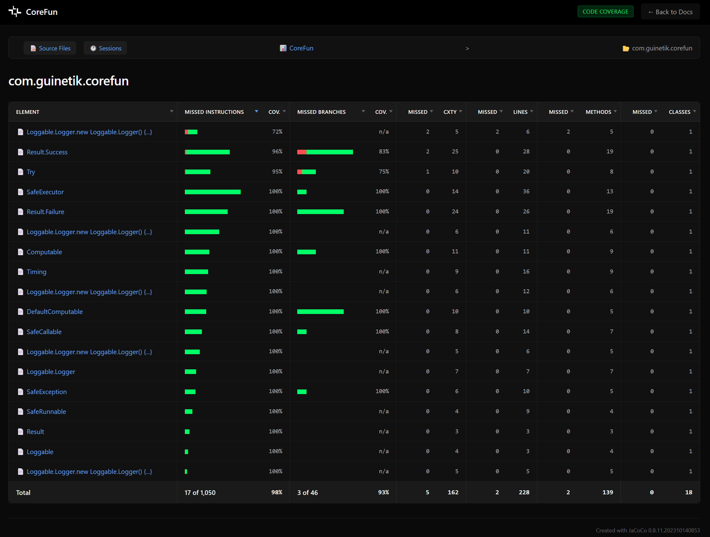

# Terminal Javadocs

[](https://central.sonatype.com/artifact/com.guinetik/terminaljavadocs)
[](https://opensource.org/licenses/Apache-2.0)

Dark terminal-themed Maven site styling for Java documentation. Features a sleek black-and-green aesthetic for your Maven sites, Javadoc, and JaCoCo coverage reports.



## Features

- **Dark Terminal Theme** - Black background with terminal green accents
- **Prism.js Syntax Highlighting** - Green-on-black code blocks
- **Styled Javadoc** - Custom header with navigation back to docs
- **JaCoCo Theme** - Dark coverage reports with themed progress bars
- **Responsive Design** - Works on mobile devices
- **Zero Config** - Just inherit and go

## Screenshots

### Javadoc



### JaCoCo Coverage Reports



## Quick Start

### 1. Add Parent POM

```xml
<parent>
    <groupId>com.guinetik</groupId>
    <artifactId>terminaljavadocs</artifactId>
    <version>1.0.0</version>
</parent>
```

### 2. Create `src/site/site.xml`

This file tells Maven how to style your site. Copy this starter template:

```xml
<?xml version="1.0" encoding="UTF-8"?>
<project xmlns="http://maven.apache.org/DECORATION/1.8.0"
    xmlns:xsi="http://www.w3.org/2001/XMLSchema-instance"
    xsi:schemaLocation="http://maven.apache.org/DECORATION/1.8.0
        https://maven.apache.org/xsd/decoration-1.8.0.xsd"
    name="My Project">

    <skin>
        <groupId>org.apache.maven.skins</groupId>
        <artifactId>maven-fluido-skin</artifactId>
        <version>2.0.0-M8</version>
    </skin>

    <custom>
        <fluidoSkin>
            <topBarEnabled>true</topBarEnabled>
            <sideBarEnabled>false</sideBarEnabled>
            <navBarStyle>navbar-dark</navBarStyle>
        </fluidoSkin>
    </custom>

    <body>
        <head>
            <![CDATA[
                <link href="https://cdnjs.cloudflare.com/ajax/libs/prism/1.29.0/themes/prism.min.css" rel="stylesheet" />
                <link href="./css/prism-terminal.css" rel="stylesheet" />
                <script src="https://cdnjs.cloudflare.com/ajax/libs/prism/1.29.0/prism.min.js" defer></script>
                <script src="https://cdnjs.cloudflare.com/ajax/libs/prism/1.29.0/components/prism-java.min.js" defer></script>
                <script src="./js/custom.js" defer></script>
            ]]>
        </head>

        <menu name="Overview">
            <item name="Introduction" href="index.html"/>
        </menu>

        <menu name="Documentation">
            <item name="Javadoc" href="apidocs/index.html"/>
        </menu>

        <menu name="Project Information" ref="reports"/>
    </body>
</project>
```

### 3. Build Your Site

```bash
mvn clean site
```

Your themed site will be generated at `target/site/index.html`.

## Documentation

- **[Quick Start Guide](https://guinetik.github.io/terminaljavadocs/quickstart.html)** - Detailed setup with all configuration options explained
- **[Customization](https://guinetik.github.io/terminaljavadocs/customization.html)** - Advanced theming and overrides

## JaCoCo Dark Theme

To apply the dark theme to JaCoCo coverage reports:

```bash
mvn clean site -Pterminaljavadocs-jacoco
```

Or enable it permanently in your `pom.xml`:

```xml
<profiles>
    <profile>
        <id>terminaljavadocs-jacoco</id>
        <activation>
            <activeByDefault>true</activeByDefault>
        </activation>
    </profile>
</profiles>
```

## How It Works

When your project inherits from `terminaljavadocs`:

1. **Pre-site phase**: Resources (CSS/JS) are unpacked from the `terminaljavadocs-resources` JAR
2. **Site phase**: Maven Fluido Skin generates the site with the dark navbar
3. **Site phase**: Our CSS overrides apply the terminal theme

## License

Apache License 2.0
